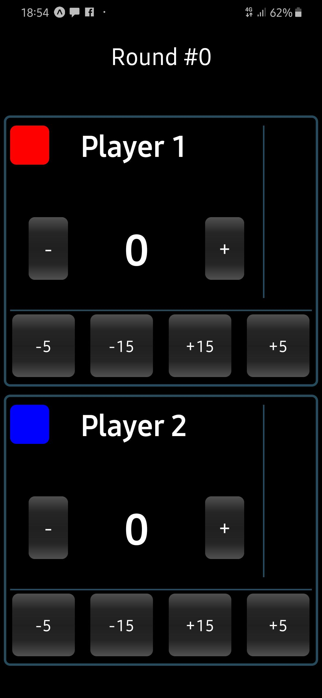

#RN - Score Keeper
#### A simple score keeper app created with expo (react-native)

## Running the project:
- clone the project
- `cd RN-ScoreKeeper
- `npm i` or `yarn`
- `npm run start` or `yarn start`
- enjoy!

### To do:
- add SplashScreen
- add app icon
- add react-navigation
- add settings in order to configure buttons
- add delay to score registering
- add score history

### Landscape Screenshot:

### Portrait Screenshot:

